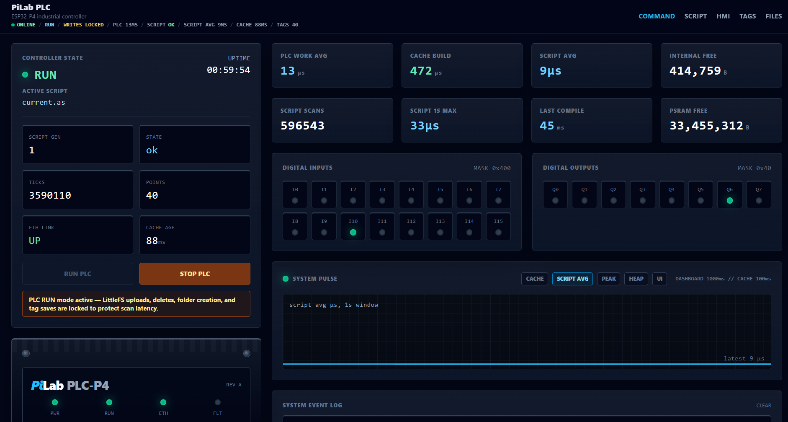
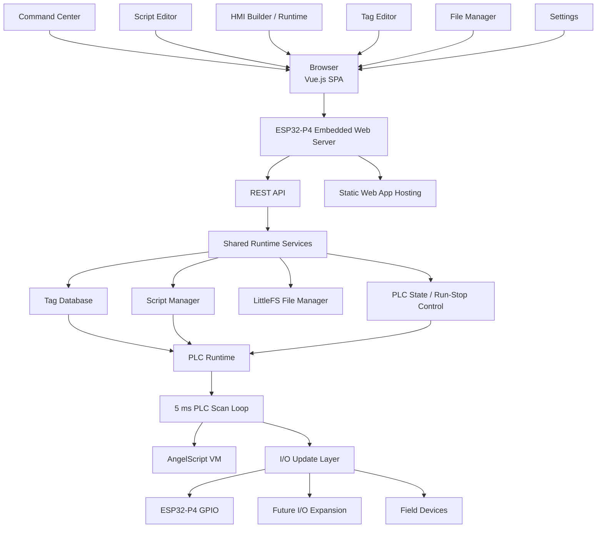
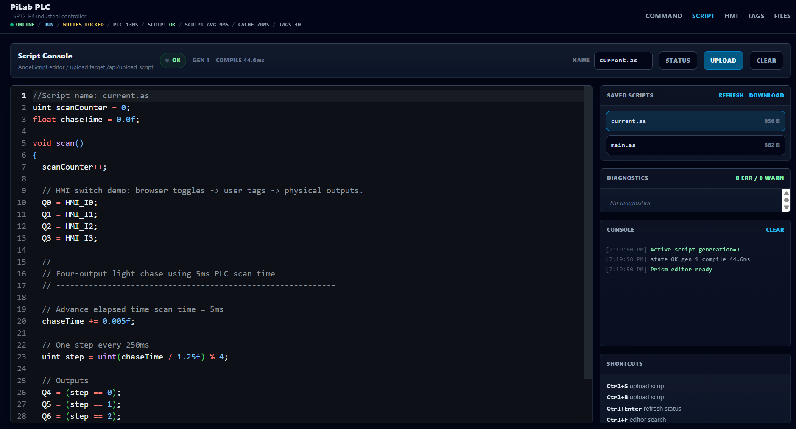
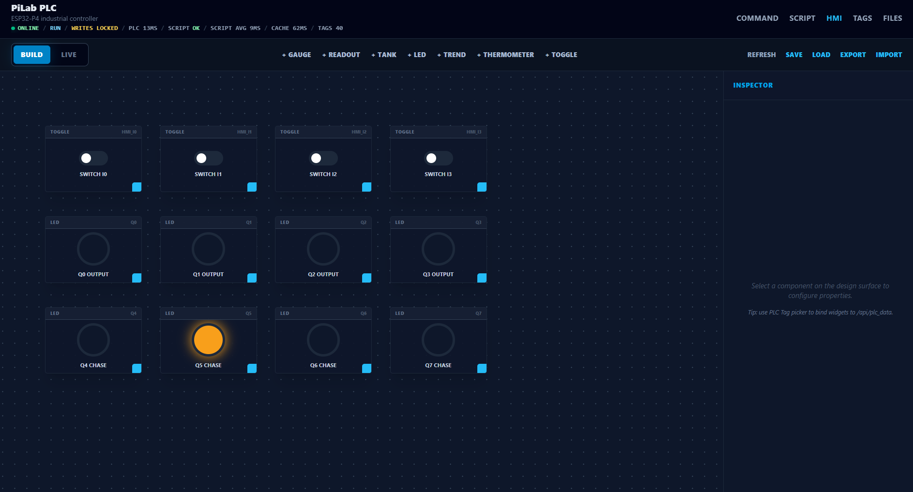
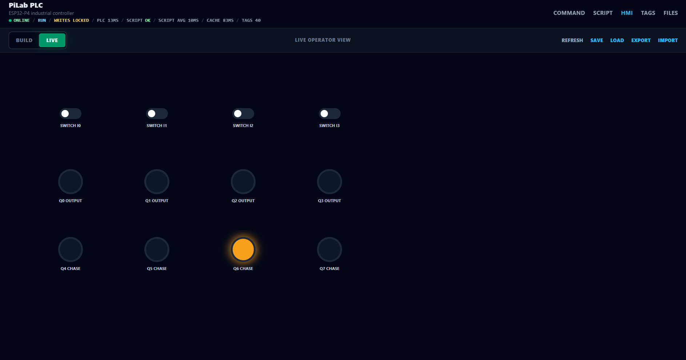
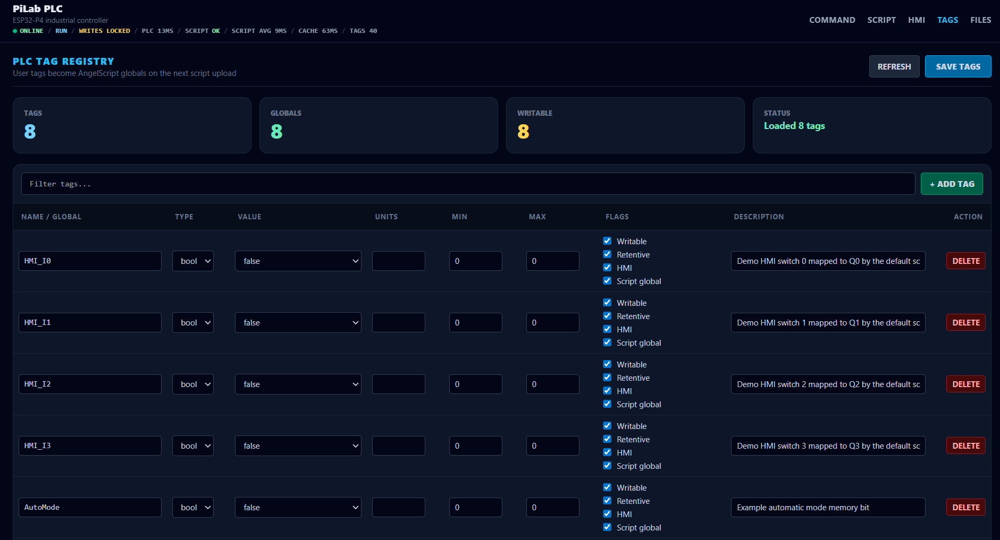
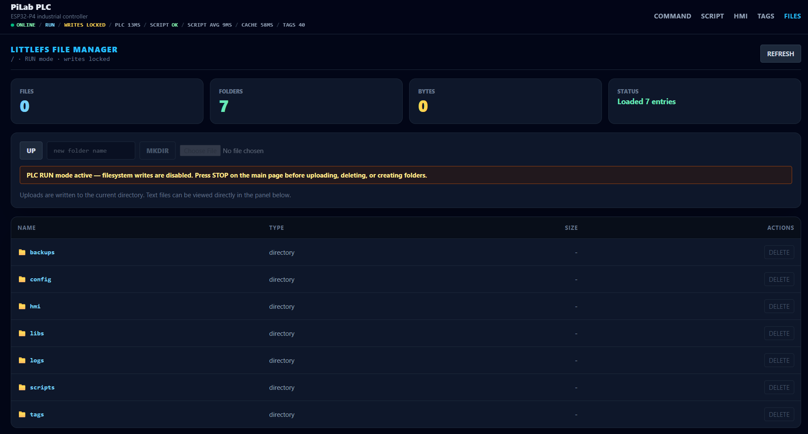

# pilab-esp32-p4-plc
PiLab P4 is an experimental browser-first PLC/HMI platform running directly on the ESP32-P4.

# Web App


# System Architecture



# Video Demo
https://www.youtube.com/watch?v=MBs3DlIrDFY

# PiLab ESP32-P4 PLC (Alpha)

Experimental ESP32-P4 PLC/HMI platform with an embedded Vue.js SPA, AngelScript runtime, browser-based programming, file manager, tag registry, and web HMI.

---

# What is this?

PiLab is an experimental PLC-style automation platform running directly on the ESP32-P4.

The system combines:

- Real-time PLC scan loop
- AngelScript runtime for machine logic
- Browser-based code editor
- Embedded Vue.js single-page web application
- HMI designer/runtime
- Tag registry
- File manager using LittleFS
- REST API for live PLC data
- Fully self-hosted web interface on the ESP32-P4

The goal is to create a lightweight, modern, browser-first automation platform without requiring heavy desktop software or proprietary tooling.

---

# Example PLC / Edge Scripts

## Analog Signal Processing + Heartbeat

Example script showing:

- cyclic PLC scan logic
- array usage
- floating point math
- string handling
- edge-style sensor processing

```cpp
array<float> samples;
uint counter = 0;

void scan()
{
    samples.resize(32);

    float average = 0.0f;

    for (uint i = 0; i < samples.length(); i++)
    {
        float phase = float((counter + i) % 628) * 0.01f;

        samples[i] = 50.0f + sin(phase) * 10.0f;

        average += samples[i];
    }

    average /= samples.length();

    string status = "RUNNING";

    if (average > 55.0f)
        status = "HIGH";

    if (average < 45.0f)
        status = "LOW";

    // Example PLC outputs
    Q0 = average > 52.0f;
    Q1 = average < 48.0f;

    counter++;
}
```

## Simple Edge Vibration Monitor

Example script simulating vibration monitoring and alarm detection.

```cpp
array<float> vibration;
float rms = 0.0f;
bool alarm = false;

void scan()
{
    vibration.resize(64);

    float acc = 0.0f;

    for (uint i = 0; i < vibration.length(); i++)
    {
        float noise =
            sin(float(i) * 0.21f) * 2.0f +
            cos(float(i) * 0.07f) * 1.5f;

        vibration[i] = noise;

        acc += vibration[i] * vibration[i];
    }

    rms = sqrt(acc / vibration.length());

    // Alarm threshold
    alarm = rms > 2.2f;

    // PLC outputs
    Q0 = alarm;
    Q1 = !alarm;
}
```


## PLC-Style Timer Logic (TON)

Example showing IEC-style PLC timer logic implemented directly in AngelScript.

```cpp
class TON
{
    uint preset_ms;
    uint elapsed_ms;

    bool input;
    bool output;

    TON(uint preset)
    {
        preset_ms = preset;
        elapsed_ms = 0;
        input = false;
        output = false;
    }

    void update(bool in, uint scan_ms)
    {
        input = in;

        if (input)
        {
            if (elapsed_ms < preset_ms)
                elapsed_ms += scan_ms;

            if (elapsed_ms >= preset_ms)
                output = true;
        }
        else
        {
            elapsed_ms = 0;
            output = false;
        }
    }

    bool Q()
    {
        return output;
    }

    uint ET()
    {
        return elapsed_ms;
    }
};

TON motorStartDelay(2000);

void scan()
{
    // Start motor 2 seconds after input turns on
    motorStartDelay.update(I0, 5);

    Q0 = motorStartDelay.Q();
}
```

## Rising Edge Trigger + Alarm Latch

Example showing PLC-style edge detection and alarm latching.

```cpp
class RisingEdge
{
    bool last = false;

    bool update(bool input)
    {
        bool edge = input && !last;
        last = input;
        return edge;
    }
};

class AlarmLatch
{
    bool latched = false;

    void trigger()
    {
        latched = true;
    }

    void reset()
    {
        latched = false;
    }

    bool active()
    {
        return latched;
    }
};

RisingEdge startEdge;
AlarmLatch alarm;

void scan()
{
    // Detect rising edge
    if (startEdge.update(I0))
    {
        Q0 = true;
    }

    // Example alarm condition
    if (AI0 > 85.0f)
    {
        alarm.trigger();
    }

    // Reset alarm
    if (I1)
    {
        alarm.reset();
    }

    Q1 = alarm.active();
}
```


---


# Development Approach

This project was developed using a combination of:

- Traditional engineering and debugging
- Iterative prototyping
- AI-assisted development workflows

AI tools were used as engineering copilots to accelerate:
- boilerplate generation
- refactoring
- debugging
- UI migration
- documentation
- architecture exploration

All integration, testing, hardware validation, timing analysis, and final design decisions were performed manually during development.

The goal of the project is not only to explore embedded PLC/HMI architecture, but also modern AI-assisted engineering workflows.

One of the specific interests for this project is using LLM's to generate and debug machine logic.  This is much more difficult with vendor PLC's and HMI because of the closed binary systems.

---

# Current Features

## Web Interface

- Vue.js SPA embedded directly into firmware
- Hard-refresh-safe routing
- Browser-based navigation
- No external web server required

Routes:

```text
/
 /hmi
 /tags
 /files
 /script
 /editor
```

---

## PLC Runtime

- Cyclic PLC scan task
- Digital I/O support
- PLC run/stop control
- Shared tag database
- Live polling APIs

---

## AngelScript Integration

- Browser-based script editor
- Script upload/build/run
- Compiler error reporting
- Live scan timing display
- Runtime execution environment

---

## HMI

- Browser-based HMI
- Retains state across route changes
- Live PLC data updates
- Tag binding support

---

## File System

- LittleFS support
- Upload/download/delete files
- Directory creation
- PLC-safe upload restrictions

---

# Hardware

Currently tested on:

- ESP32-P4
- Ethernet-enabled ESP32-P4 configurations
- https://www.amazon.ca/Waveshare-ESP32-P4-Module-High-Performance-Development-ESP32-P4/dp/B0F2MP483W

Main software stack:

- ESP-IDF v6.x
- Vue 3
- Vite
- TailwindCSS
- AngelScript

---

# Repository Layout

```text
pilab-esp32-p4-plc/
├── firmware/
│   └── P4_PLC_Base/
├── web/
│   └── WebProject2/
├── docs/
│   └── images/
├── examples/
└── README.md
```

---

# Building the Vue App

From the Vue project folder:

```bash
cd web/WebProject2
npm install
npm run build
```

The production output will be generated in:

```text
dist/
```

Current build output:

```text
dist/index.html
dist/assets/index.css
dist/assets/app.js
```

---

# Embedding the Vue App Into Firmware

Copy the built Vue files into the ESP-IDF project:

```text
firmware/P4_PLC_Base/main/web/
```

Result:

```text
main/web/index.html
main/web/assets/index.css
main/web/assets/app.js
```

The firmware embeds these files directly using:

```cmake
EMBED_FILES
```

inside:

```text
main/CMakeLists.txt
```

---

# Building the ESP-IDF Firmware

## Requirements

- ESP-IDF v6.x
- Python environment configured for ESP-IDF
- Node.js + npm

---

## Build Firmware

```bash
cd firmware/P4_PLC_Base
idf.py build
```

---

## Flash Firmware

```bash
idf.py flash
```

---

## Flash + Monitor

```bash
idf.py flash monitor
```

---

# Development Workflow

## Run Vue App Against Live ESP32-P4

Set target IP:

### PowerShell

```powershell
$env:P4_TARGET="http://192.168.5.210"
npm run dev
```

### cmd.exe

```cmd
set P4_TARGET=http://192.168.5.210
npm run dev
```

The Vite dev server proxies `/api/...` requests to the ESP32-P4.

---

# API Overview

Examples:

```text
/api/command_center
/api/plc_data
/api/plc_write
/api/script_status
/api/files/list
/api/files/upload
/api/files/delete
/api/tags
```

---

# Current Project Status

## Alpha / Experimental

This project is currently:

- Experimental
- Under active development
- Subject to breaking changes
- Not optimized
- Not hardened for production deployment

The focus right now is architecture, usability, workflow, and iteration speed.

---

# NOT Safety Certified

This project is:

- NOT SIL rated
- NOT safety certified
- NOT validated for industrial safety applications
- NOT guaranteed deterministic under all conditions

Do NOT use this system for:

- Human safety systems
- Emergency stop systems
- Critical industrial control
- Hazardous environments

This is currently an experimental development platform.

---

# Known Limitations

- Limited long-term runtime testing
- Minimal security/authentication
- No user management
- Limited protocol support
- File operations restricted while PLC is running
- No persistent project backup/export system yet

---

# Screenshots

The screenshots below show the current browser-based PiLab PLC interface running against the ESP32-P4 controller.

## Command Center

Live PLC status, scan timing, memory, script state, digital I/O, run/stop control, and system pulse history.


---

## Script Editor

Browser-based AngelScript editor with upload, compile status, saved scripts, diagnostics, console output, and keyboard shortcuts.



---

## HMI Builder

Browser-based HMI design mode with draggable widgets, tag-bound controls, live preview support, and an inspector panel.



---

## HMI Live Operator View

Runtime HMI operator screen showing live toggles and output indicators driven by PLC tags.



---

## Tag Registry

PLC tag editor for user tags, AngelScript globals, type selection, writable/retentive/HMI flags, and descriptions.



---

## File Manager

LittleFS file browser with folders, upload controls, and write-lock protection while the PLC scan is running.



---

# Why This Project Exists

Many PLC/HMI systems still rely on:

- Large desktop IDEs
- Proprietary runtimes
- Heavy installation requirements
- Complex deployment workflows

PiLab explores a different direction:

- Browser-first tooling
- Embedded web technologies
- Lightweight deployment
- Fast iteration cycles
- Open experimentation
- AI-assisted control scripts and HMI screens

---

# License

- MIT

---

# Contributing

Contributions, testing, bug reports, and ideas are welcome.

This project is evolving rapidly.

---

# Acknowledgements

- Espressif
- Vue.js
- Vite
- TailwindCSS
- AngelScript
